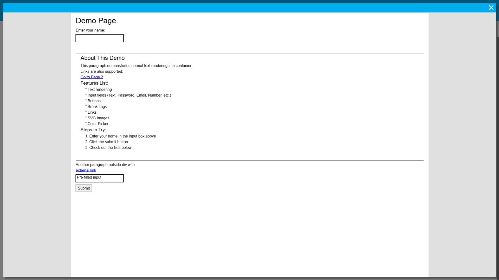
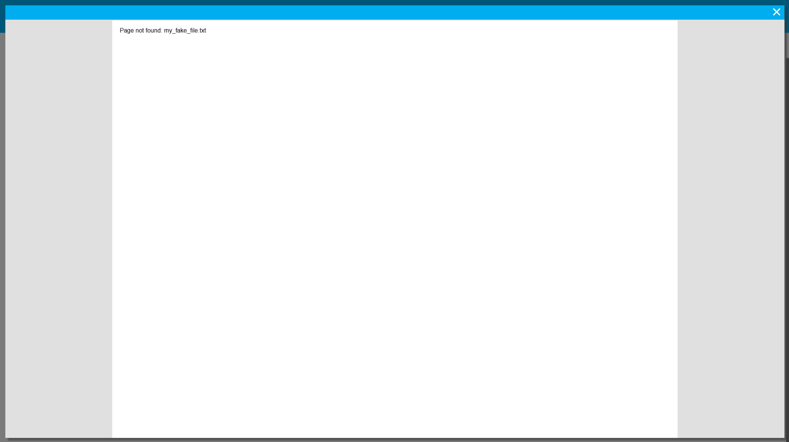
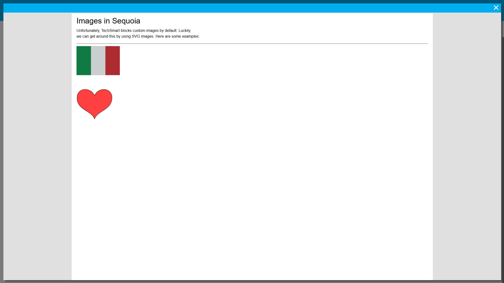
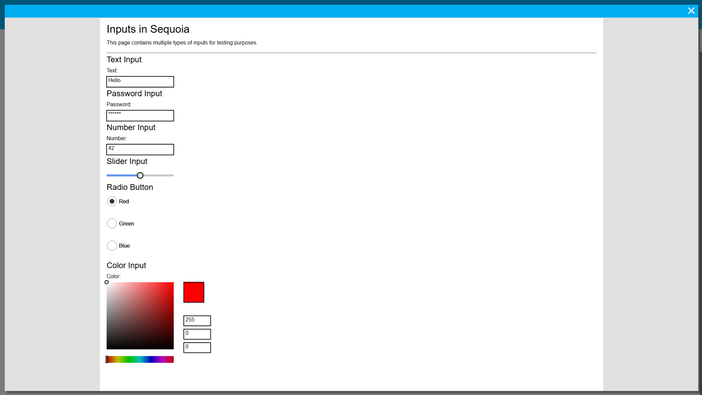

# Sequoia Browser Engine 🌳

Sequoia is a lightweight HTML browser engine built in **Python** using **PyGame**. It’s designed for educational purposes and allows you to render HTML elements, SVGs, inputs, tables, and more all in TechSmart.  

Sequoia does **not support JPG or PNG** (yet); all rendering is drawn in PyGame.

---

## Features

- **Text Rendering** - Support for `<h1>` to `<h6>`, paragraphs, bold, italic, etc.
- **Tables** - Fully functional table rendering.
- **SVG Images** - Render SVG files inside your HTML.
- **Links** - Support `<a>` tags for navigation between pages.
- **Inputs** - Includes:
  - Color Picker
  - Sliders
  - Radio Buttons
  - Normal Buttons
  - Email, Password, Number, and Text fields
- **Fully rendered in PyGame** (Works without external image files (aside from SVGs)).

---

## Examples

### Demo Page
A basic example showing Sequoia in action.
  
[See the example](./samples/demo_page/index.html)

### File Not Found
How Sequoia handles missing pages.
  
[See the example](./samples/file_not_found/index.html)

### Images Example
Demo of loading and displaying SVG images.
  
[See the example](./samples/image_loading/images.txt)

### Inputs Example
Interactive demo of Sequoia’s input elements.
  
[See the example](./samples/inputs_demo/index.html)

Features
 - Text Inputs
 - Email Inputs
 - Password Inputs
 - Number Inputs
 - Slider Inputs
 - Radio Buttons
 - Standard Buttons
 - Color Picker (24-bit truecolor)

---

Everything in Sequoia is meant to resemble the standard HTML5 syntax as closely as possible
